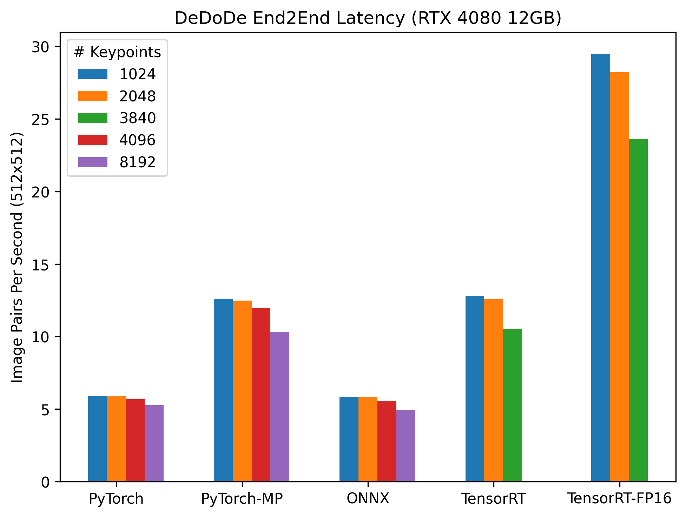

[](/LICENSE)
[](https://onnx.ai/)
[](https://developer.nvidia.com/tensorrt)
[](https://github.com/fabio-sim/DeDoDe-ONNX-TensorRT/stargazers)
[](https://github.com/fabio-sim/DeDoDe-ONNX-TensorRT/releases)

# DeDoDe-ONNX-TensorRT
Open Neural Network Exchange (ONNX) compatible implementation of [DeDoDe 🎶 Detect, Don't Describe - Describe, Don't Detect, for Local Feature Matching](https://github.com/Parskatt/DeDoDe). Supports TensorRT 🚀.

<p align="center"><br><em>The DeDoDe detector learns to detect 3D consistent repeatable keypoints, which the DeDoDe descriptor learns to match. The result is a powerful decoupled local feature matcher.</em></p>

<p align="center"><a href="#⏱️-inference-time-comparison"></a><br><em>DeDoDe ONNX TensorRT provides a 2x speedup over PyTorch.</em></p>

## 🔥 ONNX Export

Prior to exporting the ONNX models, please install the [requirements](/requirements.txt).

To convert the DeDoDe models to ONNX, run [`export.py`](/export.py). We provide two types of ONNX exports: individual standalone models, and a combined end-to-end pipeline (recommended for convenience) with the `--end2end` flag.

<details>
<summary>Export Example</summary>
<pre>
python export.py \
    --img_size 256 256 \
    --end2end \
    --dynamic_img_size --dynamic_batch \
    --fp16
</pre>
</details>

If you would like to try out inference right away, you can download ONNX models that have already been exported [here](https://github.com/fabio-sim/DeDoDe-ONNX-TensorRT/releases) or run `./weights/download.sh`.

## ⚡ ONNX Inference

With ONNX models in hand, one can perform inference on Python using ONNX Runtime (see [requirements-onnx.txt](/requirements-onnx.txt)).

The DeDoDe inference pipeline has been encapsulated into a runner class:

```python
from onnx_runner import DeDoDeRunner

images = DeDoDeRunner.preprocess(image_array)
# images.shape == (2B, 3, H, W)

# Create ONNXRuntime runner
runner = DeDoDeRunner(
    end2end_path="weights/dedode_end2end_1024.onnx",
    providers=["CUDAExecutionProvider", "CPUExecutionProvider"],
    # TensorrtExecutionProvider
)

# Run inference
matches_A, matches_B, batch_ids = runner.run(images)

matches_A = DeDoDeRunner.postprocess(matches_A, H_A, W_A)
matches_B = DeDoDeRunner.postprocess(matches_B, H_B, W_B)
```
Alternatively, you can also run [`infer.py`](/infer.py).

<details>
<summary>Inference Example</summary>
<pre>
python infer.py \
    --img_paths assets/im_A.jpg assets/im_B.jpg \
    --img_size 256 256 \
    --end2end \
    --end2end_path weights/dedode_end2end_1024_fp16.onnx \
    --fp16 \
    --viz
</pre>
</details>

## 🚀 TensorRT Support

TensorRT offers the best performance and greatest memory efficiency.

TensorRT inference is supported for the end-to-end model via the TensorRT Execution Provider in ONNXRuntime. Please follow the [official documentation](https://docs.nvidia.com/deeplearning/tensorrt/install-guide/index.html) to install TensorRT. The exported ONNX models must undergo [shape inference](/tools/symbolic_shape_infer.py) for compatibility with TensorRT.

<details>
<summary>TensorRT Example</summary>
<pre>
python tools/symbolic_shape_infer.py \
  --input weights/dedode_end2end_1024.onnx \
  --output weights/dedode_end2end_1024_trt.onnx \
  --auto_merge<br>
CUDA_MODULE_LOADING=LAZY && python infer.py \
  --img_paths assets/DSC_0410.JPG assets/DSC_0411.JPG \
  --img_size 256 256 \
  --end2end \
  --end2end_path weights/dedode_end2end_1024_trt.onnx \
  --trt \
  --viz
</pre>
</details>

The first run will take longer because TensorRT needs to initialise the `.engine` and `.profile` files. Subsequent runs should use the cached files. Only static input shapes are supported. Note that TensorRT will rebuild the cache if it encounters a different input shape.

## ⏱️ Inference Time Comparison

The inference times of the end-to-end DeDoDe pipelines are shown below.

<table align="center"><thead><tr><th># Keypoints</th><th>1024</th><th>2048</th><th>3840</th><th>4096</th><th>8192</th></tr><tr><th></th><th colspan="5">Latency (ms) (RTX 4080 12GB)</th></tr></thead><tbody><tr><td>PyTorch</td><td>169.72</td><td>170.42</td><td>N/A</td><td>176.18</td><td>189.53</td></tr><tr><td>PyTorch-MP</td><td>79.42</td><td>80.09</td><td>N/A</td><td>83.8</td><td>96.93</td></tr><tr><td>ONNX</td><td>170.84</td><td>171.83</td><td>N/A</td><td>180.18</td><td>203.37</td></tr><tr><td>TensorRT</td><td>78.12</td><td>79.59</td><td>94.88</td><td>N/A</td><td>N/A</td></tr><tr><td>TensorRT-FP16</td><td>33.9</td><td>35.45</td><td>42.35</td><td>N/A</td><td>N/A</td></tr></tbody></table>

<details>
<summary>Evaluation Details</summary>
The inference time, or latency, of only the end-to-end DeDoDe pipeline is reported; that is, the time taken for image preprocessing, postprocessing, copying data between the host & device, or finding inliers (e.g., CONSAC/MAGSAC) is not measured. The inference time is defined as the median over all samples in the <a href="https://arxiv.org/abs/1804.00607">MegaDepth</a> test dataset. We use the data provided by <a href="https://arxiv.org/abs/2104.00680">LoFTR</a> <a href="https://github.com/zju3dv/LoFTR/blob/master/docs/TRAINING.md">here</a> - a total of 403 image pairs.

Each image is resized such that its dimensions are `512x512` before being fed into the pipeline. The inference time of the DeDoDe pipeline is then measured for different values of the detector's `num_keypoints` parameter: 1024, 2048, 4096, and 8192. Note that TensorRT has a <a href="https://docs.nvidia.com/deeplearning/tensorrt/api/python_api/infer/Graph/Layers.html?highlight=resizecoordinatetransformation#tensorrt.ITopKLayer">hard limit</a> of 3840 keypoints.

For reproducibility, the evaluation script <a href="eval.py">`eval.py`</a> is provided.


</details>

## Credits
If you use any ideas from the papers or code in this repo, please consider citing the authors of [DeDoDe](https://arxiv.org/abs/2308.08479). Lastly, if the ONNX or TensorRT versions helped you in any way, please also consider starring this repository.

```txt
@article{edstedt2023dedode,
      title={DeDoDe: Detect, Don't Describe -- Describe, Don't Detect for Local Feature Matching}, 
      author={Johan Edstedt and Georg Bökman and Mårten Wadenbäck and Michael Felsberg},
      year={2023},
      eprint={2308.08479},
      archivePrefix={arXiv},
      primaryClass={cs.CV}
}
```
